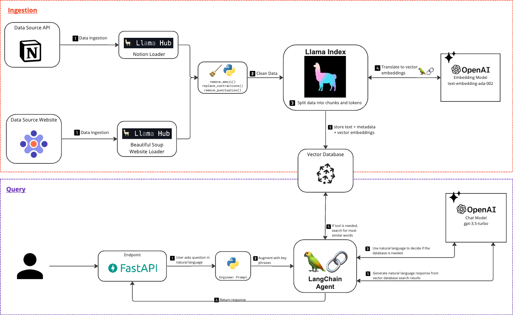

# AI Custom Chatbot Quickstart · Data Pipeline

## Table of Contents
1. [AI Custom Chatbot Quickstart · Data Pipeline](#ai-custom-chatbot-quickstart--data-pipeline)
2. [Goals](#goals)
3. [Architecture Overview](#architecture-overview)
4. [Prerequisites](#prerequisites)
5. [Set up your environment](#set-up-your-environment)
6. [Add Data Cleansing](#add-data-cleansing)
7. [Add Notion Integration](#add-notion-integration)
8. [Add Links to the AI response](#add-links-to-the-ai-response)
9. [FAQ](#faq)

This tutorial shows you how to level-up your data pipeline when building a custom AI chatbot.

We recommend setting up a basic custom chatbot first. This tutorial will build on top
of [the quicks start you can reference here]([https://github.com/focused-labs/ai-custom-chatbot-quickstart](https://github.com/focused-labs/ai-custom-chatbot-quickstart)).

For more resources: check out [our page on AI](https://focusedlabs.io/ai).

### We are using our preferred tech stack. 
- [OpenAI](https://openai.com/)
- [Langchain](https://python.langchain.com/docs/get_started/introduction)
- [Llama Hub Data Loaders](https://llamahub.ai/)
- [Pinecone Vector Database](https://pinecone.io/)
- Python [(FastAPI web framework)](https://fastapi.tiangolo.com/)

## Goals
- Increase accuracy
- Grow dataset by integrating more disparate data sources
- Earning user trust

## Technical Objectives
- Increase accuracy by implementing multiple data cleansing techniques
- Integrate Notion
- Earn user trust by providing the link to the original data source

## Architecture Overview



## Prerequisites
1. We recommend setting up a basic custom chatbot first. This tutorial will build on top
of [the quicks start you can reference here]([https://github.com/focused-labs/ai-custom-chatbot-quickstart](https://github.com/focused-labs/ai-custom-chatbot-quickstart)).
2. A Pinecone Vector Database. You can create a free account [at Pinecone's website](https://www.pinecone.io/).
3. An Open AI API account. You can sign up [at Open AI's website](https://platform.openai.com/signup).
4. Python (and your favorite IDE). We are using python v3.10.7.
5. Your favorite API client tool (our favorite is Postman, or you can use CLI curl)

## Set up your environment

For more details about how to set up your infrastructure,
reference [https://github.com/focused-labs/ai-custom-chatbot-quickstart#ingesting-data](https://github.com/focused-labs/ai-custom-chatbot-quickstart#ingesting-data).

1. Install dependencies: `pip install -r requirements.txt`
2. Start the app: `python3 main.py`
3. With your favorite API client tool, send a `get` request to the root endpoint (`localhost:8000/`)

If you receive the message “Hello World”, you are good to go 🎉

## Add Data Cleansing

Located in `text_cleaner.py`

### **************Goals:**************

1. Remove unnecessary data
2. Keep data that adds meaning to the text.

### **************Steps:**************

1. Remove emojis.
    - Add a method to remove emojis. Emojis did not add any new information to the professional-toned documents we were
      ingesting. So, by removing this duplicate data, we saw an increase in accuracy.
    - Ask yourself: “Are emojis adding new meaning to my data?” If yes, explore leaving emojis in the text.
2. Remove specific special characters
    - Add a method to remove specific special characters.
    - DO NOT remove all special characters. Characters such as the period and comma add new information and meaning to
      the data. Removing these character resulted in a decrease in accuracy.
    - Again, ask yourself: “Are these characters adding new meaning to my data?” If yes, explore leaving those
      characters in the text.
3. Replace contractions
    - Add a method that replaces common contractions.
    - This facilitates better matching of semantic meaning.

### Add Cleaned Data to Vector Database

In `import_service.py`, you’ll see each document is cleaned before being loaded into the database. To trigger this
process,

1. Start the app: `python3 main.py`
2. Send a `POST` **request to the data loading endpoint (ex: `/load-website-docs`) with the following body:

```json
{
  page_urls: [
    ""
  ]
}
```

Example:

```json
{
  page_urls: [
    "https://focusedlabs.io",
    "https://focusedlabs.io/about",
    "https://focusedlabs.io/contact",
    "https://focusedlabs.io/case-studies",
    "https://focusedlabs.io/case-studies/agile-workflow-enabled-btr-automation",
    "https://focusedlabs.io/case-studies/hertz-technology-new-markets",
    "https://focusedlabs.io/case-studies/aperture-agile-transformation",
    "https://focusedlabs.io/case-studies/automated-core-business-functionality"
  ]
}
```

## Add Notion Integration

[Llama Hub](https://llamahub.ai/) has a collection of open source data loaders you can use. We
used the [Notion loader](https://llamahub.ai/l/notion), and had fairly good success.

We added a new `POST` endpoint that allows us to trigger the ingestion of specified Notion pages
called `/load-notion-docs`. The request body requires the ids of the pages you want to upload.

```json
{
  page_ids: [
    ""
  ]
}
```

To implement this, you will need to add a Notion API key to your `.env` file.

```tsx
NOTION_API_KEY = "secret notion api key here"
```

You will also need to make sure the pages you would like to upload have the correct API permissions. [Reference the
Notion documentation about authorization](https://developers.notion.com/docs/authorization).

## Add Links to the AI response

1. Ensure that all of your data integrations include the file’s URL in the `metadata` field, as this will be referenced
   when corresponding vector is queried and selected.
    - As Llama Hub’s default Notion loader did not come with this feature, we added a method that handles the retrieval
      of the Notion page URL using Notion’s API.
2. In your retriever (ours is located in `focused_labs_q_and_a_tool.py`), set the parameter `return_source_documents` to
   **`True` .**
3. In your agent (ours is located in `agent.py`), make sure that you parse the source documents from the primary
   response. We use a json format for easy integration with the endpoint.

**To see this feature, query an agent.**

1. Start the app: `python3 main.py`
2. Send a `POST` **request to the endpoint `/ask-agent` with the following body:

```json
{
  "text": ""
}
```

Example:

```json
{
  "text": "Who is Focused Labs?"
}
```

******************Outcome:****************** You’ll receive an answer from the agent with a list of what sources from
the database it found to form an answer.

Keep in mind that it will not always return a source if one is not used. For example, if you ask the agent “how are you
today?”, that does not require the use of the vector database and thus it won’t include sources in its response.

However, if you ask the agent something related to information in the vector database like “Who is Focused Labs?”, it
will pass the source documents that it retrieves.

## FAQ

- If you run into a *`*PermissionError: [Errno 13] Permission denied:*`* then make sure you are running your app with
  Python3
- If you run into a *`*MaxRetryError...Caused by SSLError*`* when you are uploading your data to the vector database,
  wait another 5 minutes for your index to fully initialize and try again.